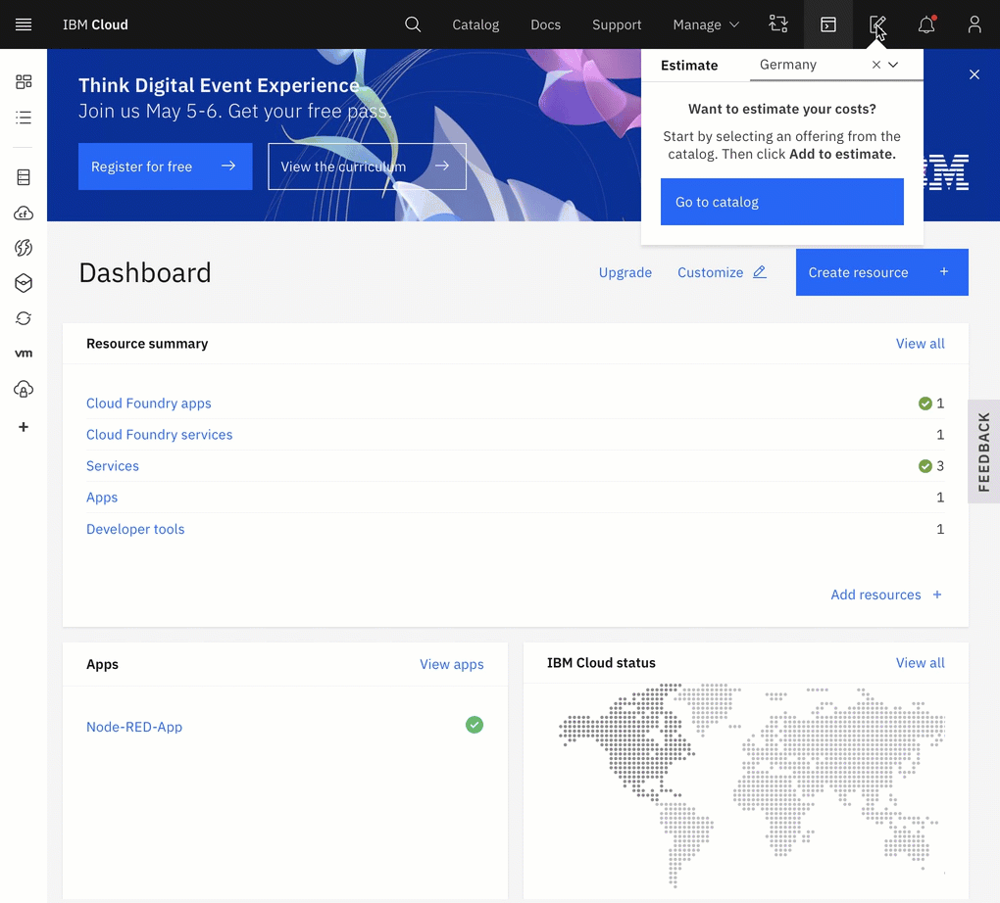

# Useful information during the Hackathon 

> We want to provide you a **fast** and **short** overview on the available IBM Cloud resources for you as a hacker, during the hackathon.

## 1) How to prepare?

Blog post: [Today I want to address a common situation for developers: You want to participate in a hackathon, and you plan to use IBM Cloud, but you have never used it before. How to prepare?](https://suedbroecker.net/2020/09/15/updated-how-to-prepare-for-a-hackathon-with-ibm-cloud/)

Technologies: [Kubernetes](https://cloud.ibm.com/kubernetes/catalog/about?platformType=), [Node-RED] (https://cloud.ibm.com/developer/appservice/create-app?starterKit=59c9d5bd-4d31-3611-897a-f94eea80dc9f&)defaultLanguage=undefined, [Cloud Foundry](https://cloud.ibm.com/cloudfoundry/overview) and [Watson Services](https://cloud.ibm.com/catalog?search=watson#search_results)

## 2) Register at IBM Cloud (Lite Account)

Register at IBM Cloud using that link:
[http://ibm.biz/ibmcloudaccount-at-slash](http://ibm.biz/ibmcloudaccount-at-slash)

## 3) Feature Codes to upgrade your Lite to a Trial Account

**a) Get the IBM Cloud feature code**

* To request a IBM Cloud feature code from the organizer at //Slash for example. A feature code does upgrade the free IBM Lite Account to a Trial Account: To request one of the feature codes fill out the following form: [http://ibm.biz/slash-request-feature-code ](http://ibm.biz/slash-request-feature-code)

* Or register at [http://cognitiveclass.ai](http://cognitiveclass.ai) for learning and get a IBM Cloud feature codes.

**b) Apply the feature code**

* [IBM Cloud documentation](https://cloud.ibm.com/docs/account?topic=account-codes)

## 4) Useful getting started resources from the Call for Code challenge

> **COVID 19 Starter kits**

These kits have been created for the Call for Code COVID-19 challenge, but can be helpful for the Hackathon:

* **Crisis communications** starter kit: [https://developer.ibm.com/callforcode/getstarted/covid-19/crisis-communication/](https://developer.ibm.com/callforcode/getstarted/covid-19/crisis-communication/)

In times of crisis, communications systems are one of the first systems to become overwhelmed. Chatbots help respond to tens, even hundreds, of thousands of messages a day. COVID-19 has prompted many people to seek answers about symptoms and testing sites as well as the current status of schools, transportation, and other public services. Using Watson Assistant, this Call for Code starter kit has designed a virtual assistant pre-loaded to understand and respond to common questions about COVID-19, scan COVID-19 news articles using Watson Discovery, and respond to COVID statistics inquires with data from trusted sources.

* **Remote education** starter kit [https://developer.ibm.com/callforcode/getstarted/covid-19/remote-education](https://developer.ibm.com/callforcode/getstarted/covid-19/remote-education)

It’s imperative that learning and creating can continue when educational institutions have to shift the way they teach in times of crises, such as the COVID-19 pandemic. Providing a set of open source tools, backed by IBM Cloud and Watson Services, will enable educators to more easily make content available for their students.

## 5) Contact IBM Cloud mentors at the #Slash Hackathon

* Use the "Discord Server" for //Slash for direct contact:
    * Sebastian Grodzietzki (IBM)
    * Thomas Südbröcker (IBM)
* Post your questions in the **"Meet our Partners area"/"#ibm"** channel
* Use twitter to contact us directly:
     * [Sebastian Grodzietzki](https://twitter.com/S_Grodzietzki)
     * [Thomas Südbröcker](https://twitter.com/tsuedbroecker)

## 6) Others

* IBM Cloud cost estimation

